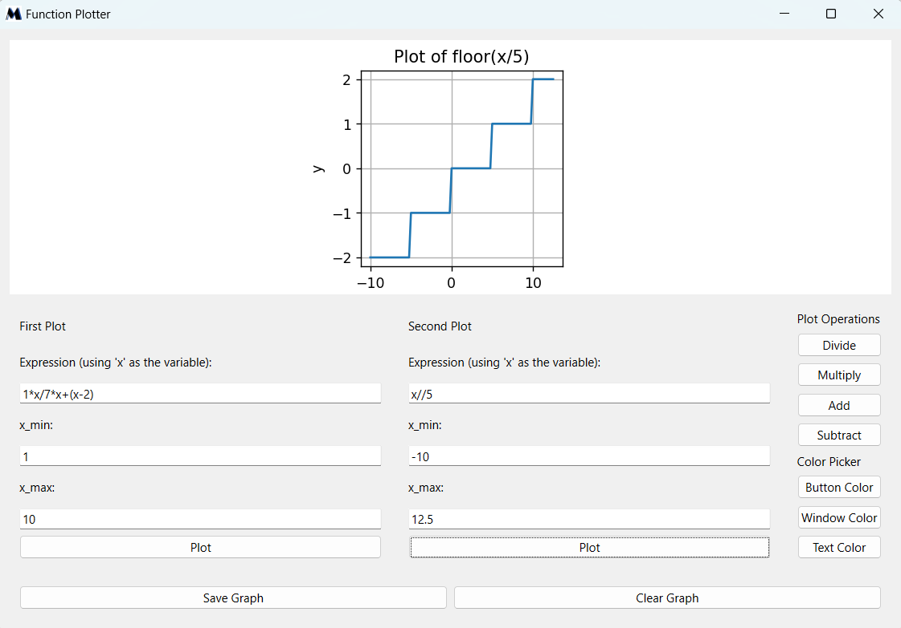
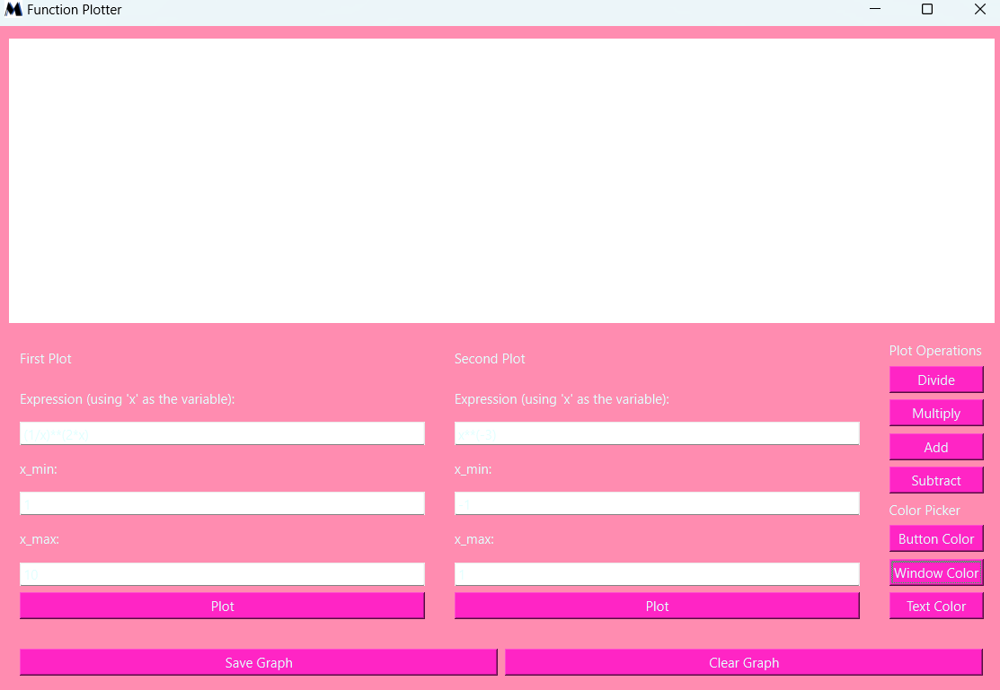
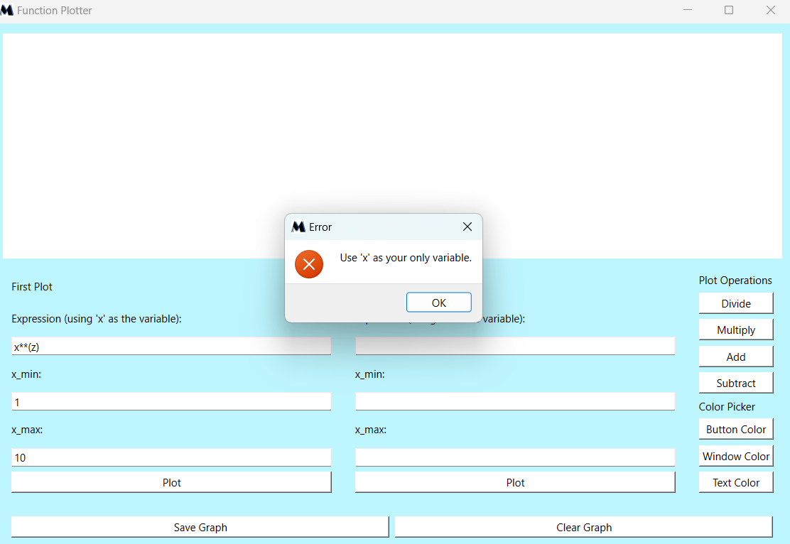

<div id = 'top'></div>

# Function-Plotter :chart_with_upwards_trend:
### Implementation of a function plotter using Pyside and matplotlib

*this was part of the recruitment process at MasterMicro 2023 SE summer internship*

<div align='center'>


*<p align='center'>Live demo</p>*

  
</div>


____________________________________________________________________

## Contents:
* <a href="#ps">Project Structure and setup</a>
* <a href="#main">Main Features</a>
* <a href="#error">Error Handling</a>
* <a href="#test">Testing</a>
______________________________________________________________________

<div id="ps">

## Project structure


```
├── app.py [Main file: Contains the welcome window]
├── testing.py [Test file using pytest and pytest-qt]
├── utilities
│ ├── functions.py [Utility functions]
│ └── layout.py [Main window layout]
├── assets [Directory for project assets]
├── snapshots [Snaps taken from the app]
└── requirements.txt [List of all required Python modules]

```
#### Getting started :
1) Clone the repository
2) Install the required dependencies by running `pip install -r requirements.txt`

```
matplotlib==3.7.2
numpy==1.25.1
PySide6==6.5.1.1
pytest==7.4.0
sympy==1.12

```
3) run `app.py` to start the application

</div>

<div id="main">

## Main Features 
the main features for this function plotter include:

I. Validate and plot mathematical expressions   

II. Plot two graph and perform basic operations on them `+ , - , * , /`

III. Save graph(s)

IV. Multiple error handling with messages specifying the error

V. Color picker for `Buttons , background window and text`

VI. Ability to clear the Graph(s) and start over

|`welcome window`|`main window`|
|-------|----|
|||

|`Feature`|`Screenshot`|
|-------|----|
|*Plot first plot*||
|*Plot second plot*||
|*1st example*||
|*2nd example*||
|*3rd example*||
|*save graph(s)*||
|*clear graph(s)*||
|*color picker*||
|*theme example*||
</div>

<div id="error">

## Error handling

|`error`|`message`|
|---|---|
|*expression with any variable but x*||
|*x_min >= x_max*||
|*absence of x_min or/and x_max*||
|*invalid mathematical expression*||
|*any symbol but numbers in x_min / x_max*||
|*save empty graph*||
|*clear empty layout*||
|*operations on one graph or empty layout*||


</div>
<div id="test">

## Testing

in general, 21 test cases were made `1 for welcome window / 11 for main features / 9 for error handling`
 
<div align='center'>

| |
|-------|
||| 
</div>

</div>


<p align="right"><a href="#top">Back to top</a></p>